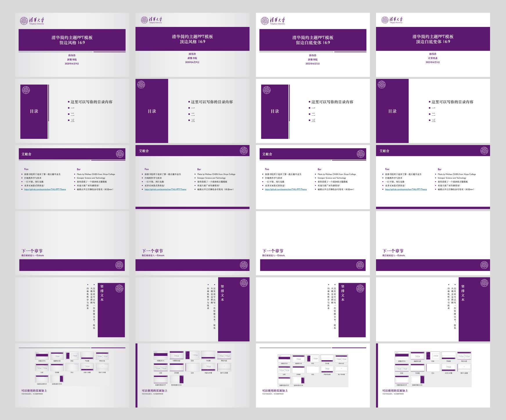
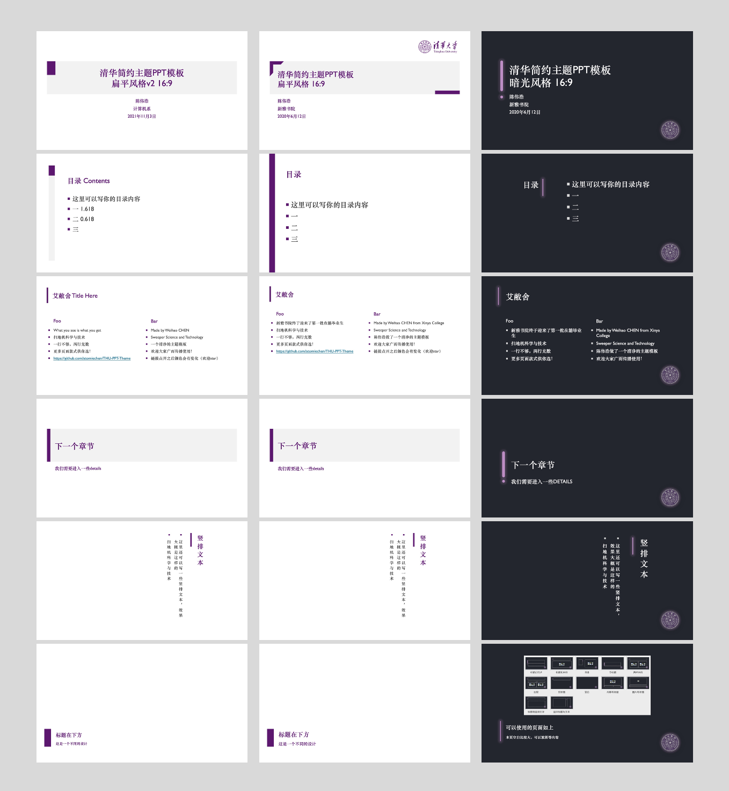
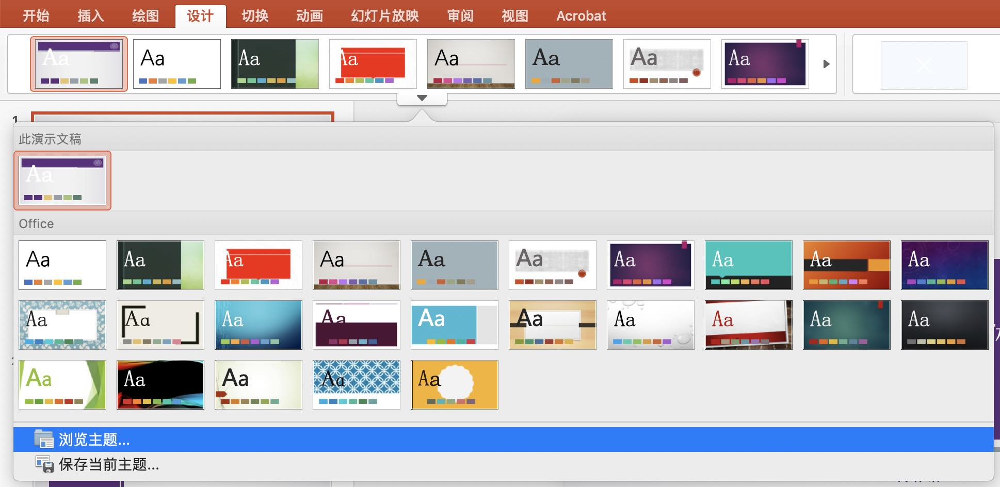

# 清华简约主题PPT模板

PS：我发现每到答辩季就会喜获一些star，谢谢大家支持！欢迎大家推广传播本repo（[https://github.com/atomiechen/THU-PPT-Theme](https://github.com/atomiechen/THU-PPT-Theme)），也欢迎大家贡献[变体](variants/README.md)，提供更多选择🤠

2020年春夏之交，答辩期间很多同学都在寻找清华主题的答辩模板。一方面有使用LaTeX制作Beamer的模板（见Overleaf上的模板[THU Beamer Theme](https://www.overleaf.com/latex/templates/thu-beamer-theme/vwnqmzndvwyb)），另一方面民间也存在着一些PPT模板。很多人可能不适应Beamer的使用（主要是内容和排版设计不是可见即所得，定制有门槛），以及我找到的PPT模板也都不太好使（要么图案设计太复杂、不好看，要么没有制作成PPT母版导致每次使用都要复制粘贴+微调，不方便）。

我制作了清华简约主题的PPT模板，后续有新的设计我会逐渐加入，也欢迎有兴趣有想法的朋友们添砖加瓦！

## 如数家珍

模板均为pptx文件。

- 2022-06重要更新：将所有浅色背景模板，全部按照《清华大学视觉形象识别系统手册》更正清华主题色，并采用矢量校徽校名图
  - V3白底变体16:9，留边和顶边都采用白色背景

- 2021-11：V2扁平16:9
  - 基于扁平风格优化，设计成一致的直角元素，删去了多余图案；取消了所有标题英文格式的默认全大写。
- 2020-06（原始）：留边、顶边、扁平和暗光四种风格，每种风格有4:3和16:9两种比例
  - 其中使用了清华紫颜色、校徽图案、含校徽的校名图案及清华标志性建筑图案，设计参考了一些既有的清华主题模板。

## 效果

16:9比例，v1留边、v1顶边、v3留边白底、v3顶边白底：

16:9比例，其他风格模板：v1扁平、v2扁平、v1暗光

其他变体设计参见 [variants/README.md](variants/README.md)。

## 使用方式

可以基于所提供的文件自行修改内容，也可以在新建的PPT文稿中应用该模板。

后者在MS Office 2019 For Mac的PowerPoint里的具体使用方式为：首先选择幻灯片尺寸为16:9或4:3→点击设计→打开下拉菜单→点击浏览主题→选择你想使用的模板文件。

本模板通过编辑幻灯片母版来设计制作。如需定制，可自行编辑幻灯片母版。

## License

<a property="dct:title" rel="cc:attributionURL" href="https://github.com/atomiechen/THU-PPT-Theme">THU-PPT-Theme</a> © 2020 by <a rel="cc:attributionURL dct:creator" property="cc:attributionName" href="https://github.com/atomiechen">Atomie CHEN</a> is licensed under <a href="http://creativecommons.org/licenses/by-nc-sa/4.0/?ref=chooser-v1" target="_blank" rel="license noopener noreferrer" style="display:inline-block;">CC BY-NC-SA 4.0</a>

