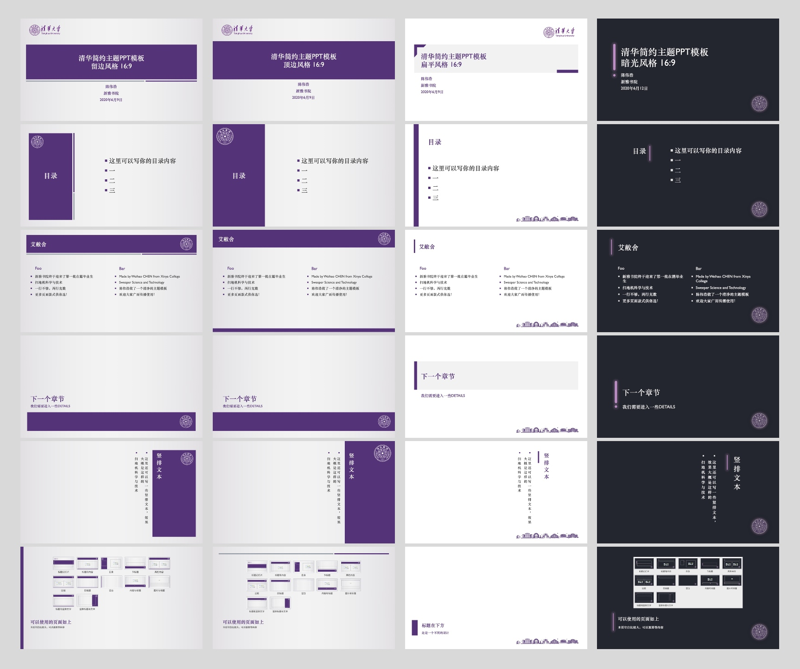

# 清华简约主题PPT模板

最近答辩期间，很多同学都在寻找清华主题的答辩模板。一方面有使用LaTeX制作Beamer的模板（见Overleaf上的模板[THU Beamer Theme](https://www.overleaf.com/latex/templates/thu-beamer-theme/vwnqmzndvwyb)），另一方面民间也存在着一些PPT模板。考虑到很多人可能不适应Beamer的使用（主要是内容和排版设计不是可见即所得，定制有门槛），以及我找到的PPT模板也都不太好使（要么图案设计太复杂、不好看，要么没有制作成PPT母版导致每次使用都要复制粘贴+微调，不方便）。

于是我制作了清华简约主题的PPT模板，有留边、顶边、扁平和暗光四种风格，每种风格有4:3和16:9两种比例，对应八个pptx文件。其中使用了清华紫颜色、校徽图案、含校徽的校名图案及清华标志性建筑图案，设计参考了一些既有的清华主题模板。

## 效果

在16:9的比例下，四个风格效果如下：

## 使用方式

可以基于所提供的文件自行修改内容，也可以在新建的PPT文稿中应用该模板。

后者在MS Office 2019 For Mac的PowerPoint里的具体使用方式为：首先选择幻灯片尺寸为16:9或4:3→点击设计→打开下拉菜单→点击浏览主题→选择你想使用的模板文件。

本模板通过编辑幻灯片母版来设计制作。如需定制，可自行编辑幻灯片母版。

## 其他

欢迎大家推广使用、改进，也欢迎提供其他清华主题的简约设计！

邮箱：atomic_cwh@163.com

